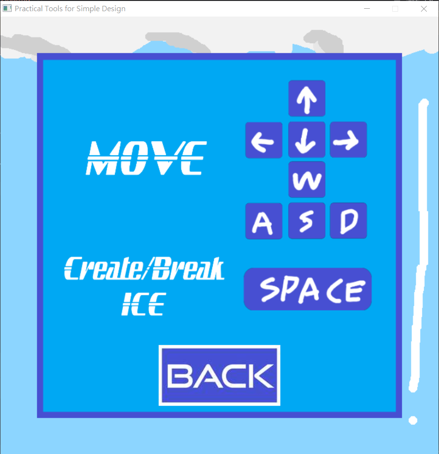
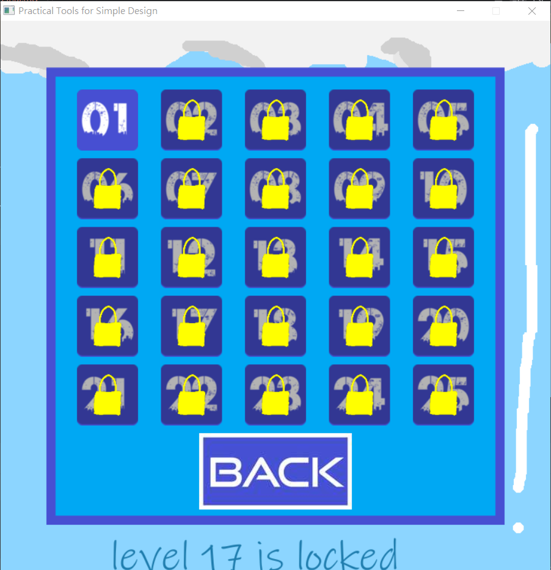
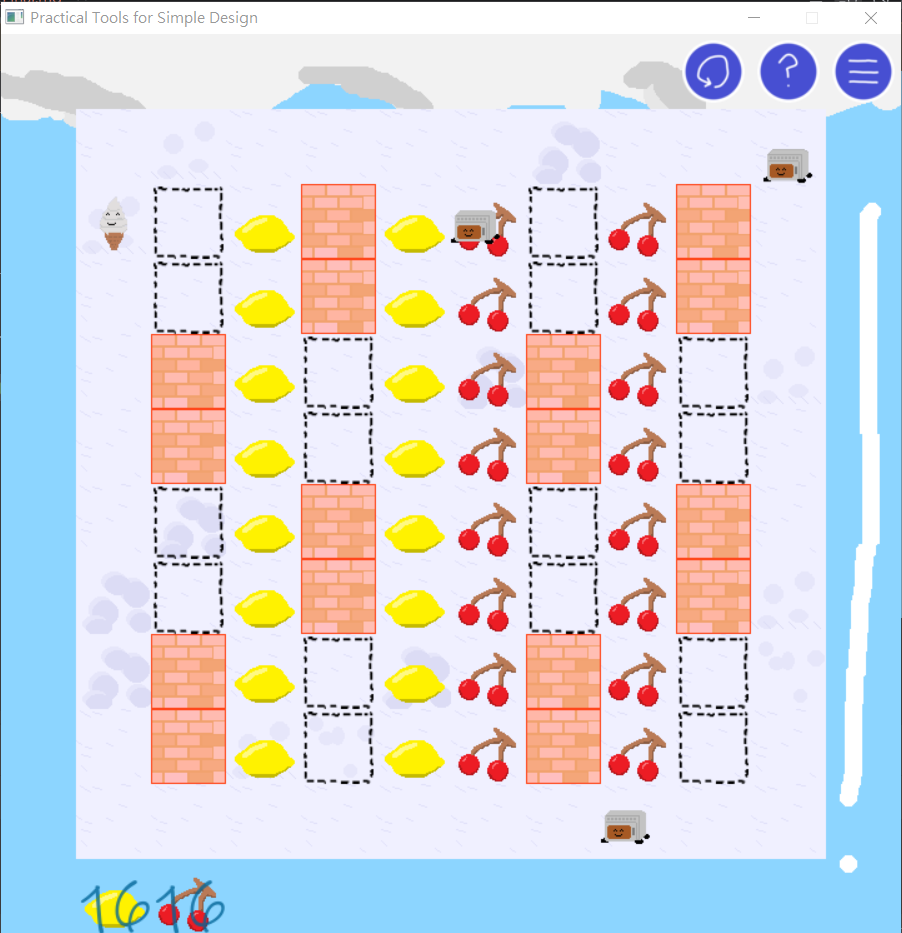
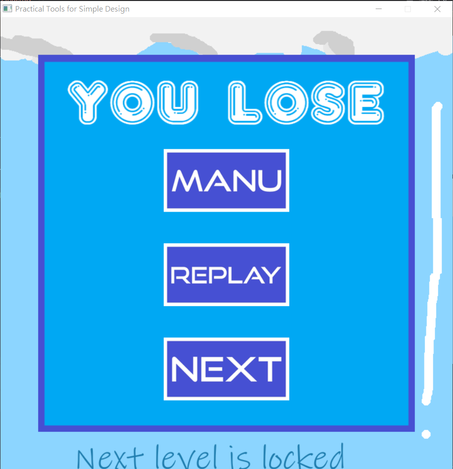
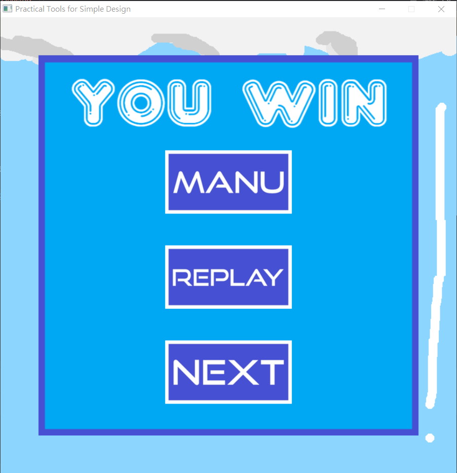

# 2025 OOPL Final Report

## 組別資訊

組別：27
組員：112820024 陳仕龍
復刻遊戲：壞壞冰淇淋

## 專案簡介

### 遊戲簡介
壞壞冰淇淋是一款使用Flash在遊戲桃、遊戲鍋、遊戲天堂等地方供應的一款遊戲。是我和弟弟國小六日一起遊玩的(少數可以雙人的)遊戲之一，雖然我沒有寫雙人的部份。屬於一種浪漫情懷。
### 組別分工
陳仕龍做美術、陳仕龍寫程式、陳仕龍找音樂、吐司機負責當吉祥物
## 遊戲介紹

### 遊戲規則
玩家操控的角色也就是主角冰淇淋，操控方式是上下左右，為了方便操作，我設定成兩邊都可以控制方向，不過是WASD或是方向鍵都能移動。另外，玩家還有一個功能是製造(破壞)冰塊，操作方式是按壓空白鍵。製造冰塊是遊戲主要且重要的一環，是唯一可以拿來抵擋敵人的方式。

遊戲的主旨是要一邊躲避敵人，一邊吃光水果。水果吃光即獲勝。碰到敵人就輸了。

除了敵人之外，還具有一些功能方塊，像是牆、空氣牆(敵人可以過)、火地板(自動融化冰塊)、冰地板(自動產生冰塊)、營火(燒起來時會對主角有害，不過可以使用冰牆熄滅)
### 遊戲畫面

## 程式設計

### 程式架構
### 程式技術

## 結語

### 問題與解決方法
### 自評

| 項次 | 項目                   | 完成 |
|------|------------------------|-------|
| 1    | 這是範例 |  V  |
| 2    | 完成專案權限改為 public |    |
| 3    | 具有 debug mode 的功能  |    |
| 4    | 解決專案上所有 Memory Leak 的問題  |    |
| 5    | 報告中沒有任何錯字，以及沒有任何一項遺漏  |    |
| 6    | 報告至少保持基本的美感，人類可讀  |    |

### 心得
### 貢獻比例