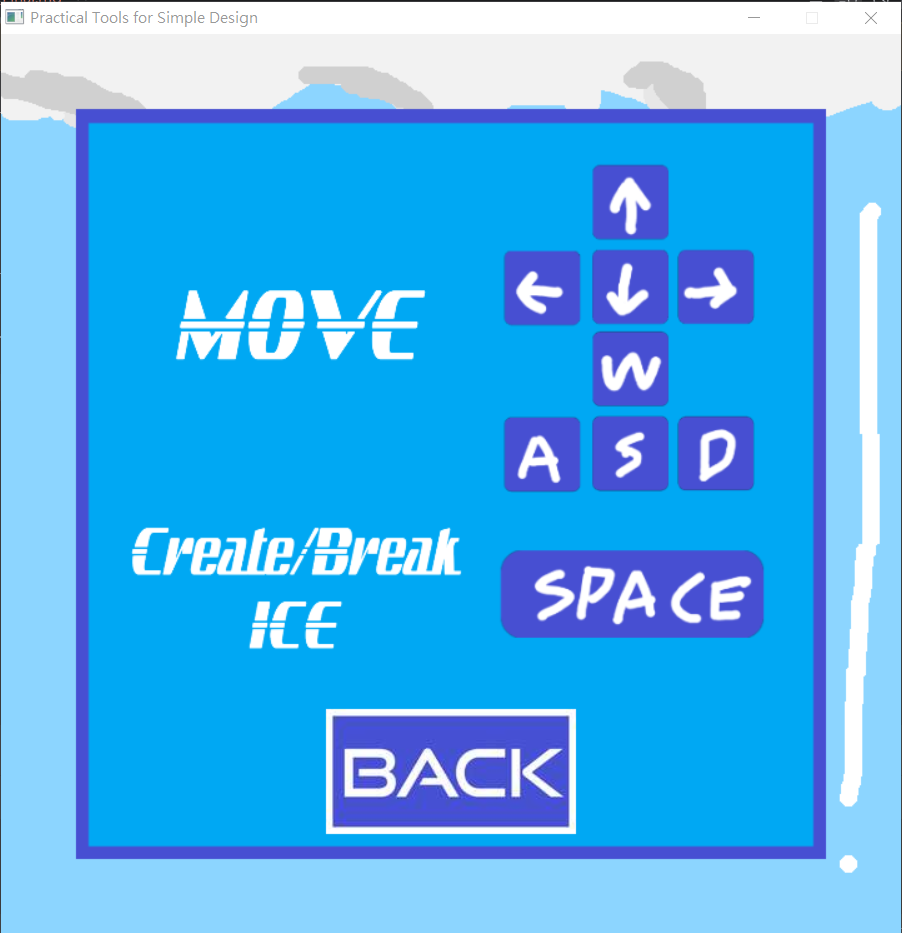
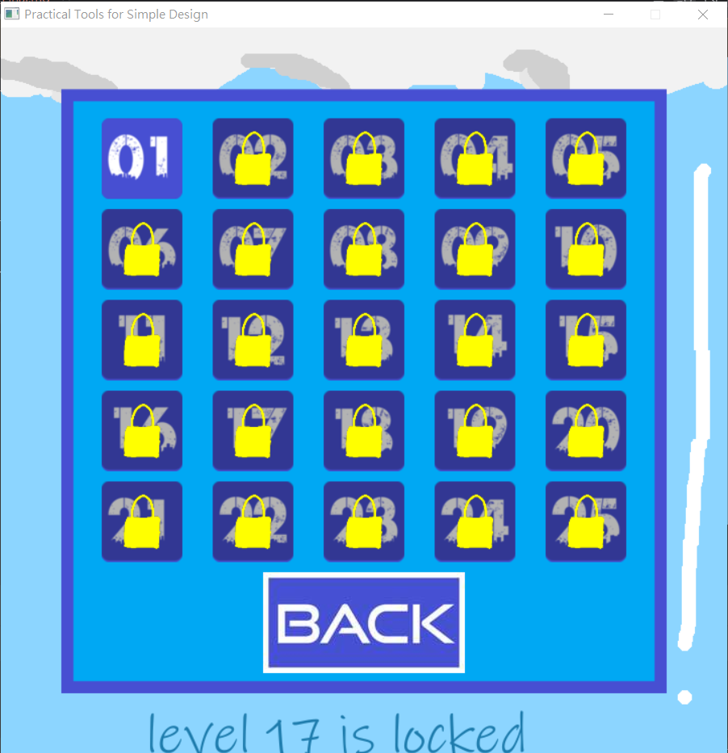
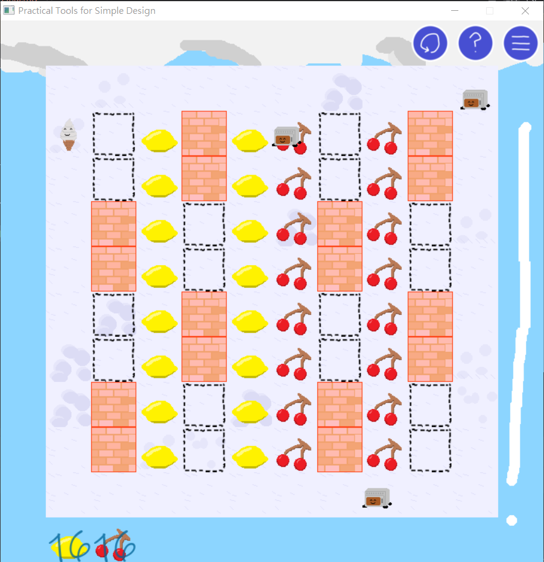
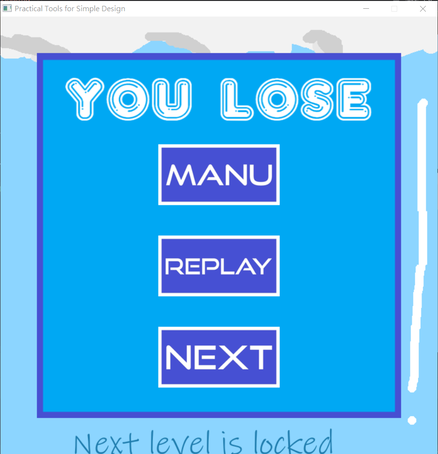
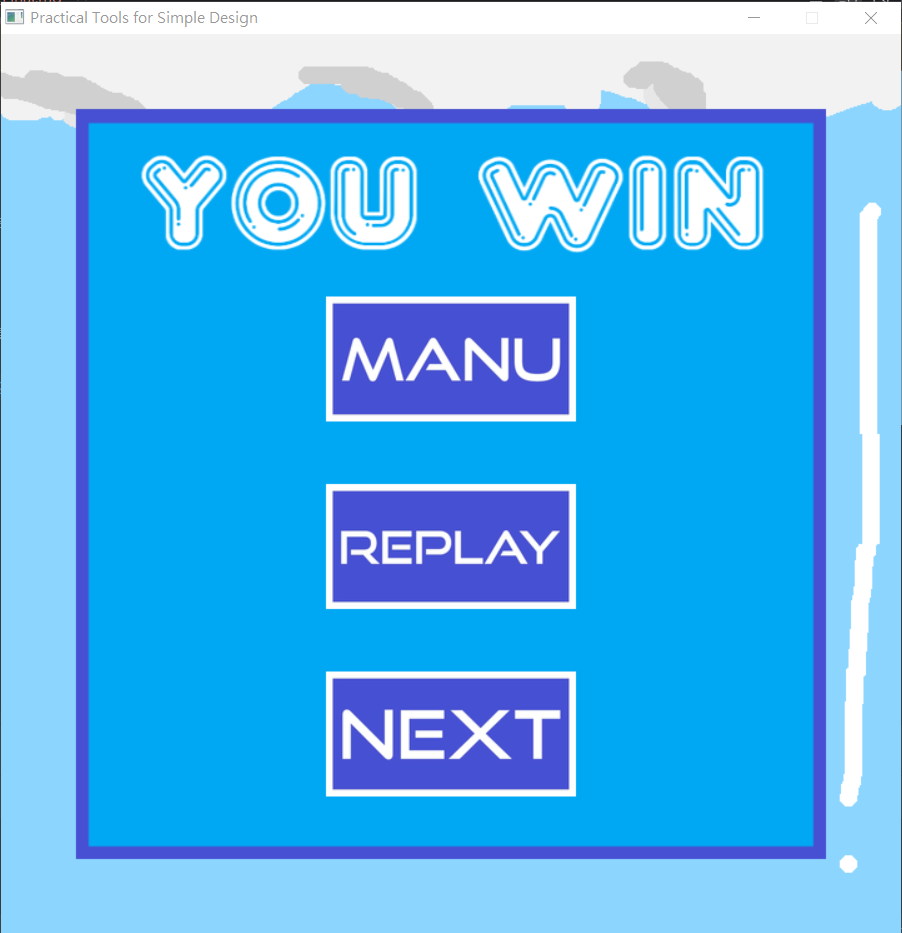

# 2025 OOPL Final Report

## 組別資訊

組別：27
組員：112820024 陳仕龍
復刻遊戲：壞壞冰淇淋

## 專案簡介

### 遊戲簡介
壞壞冰淇淋是一款使用Flash在遊戲桃、遊戲鍋、遊戲天堂等地方供應的一款遊戲。是我和弟弟國小六日一起遊玩的(少數可以雙人的)遊戲之一，雖然我沒有寫雙人的部份。屬於一種浪漫情懷。
### 組別分工
陳仕龍做美術、陳仕龍寫程式、陳仕龍找音樂、吐司機負責當吉祥物
## 遊戲介紹

### 遊戲規則
玩家操控的角色也就是主角冰淇淋，操控方式是上下左右，為了方便操作，我設定成兩邊都可以控制方向，不過是WASD或是方向鍵都能移動。另外，玩家還有一個功能是製造(破壞)冰塊，操作方式是按壓空白鍵。製造冰塊是遊戲主要且重要的一環，是唯一可以拿來抵擋敵人的方式。

遊戲的主旨是要一邊躲避敵人，一邊吃光水果。水果吃光即獲勝。碰到敵人就輸了。

除了敵人之外，還具有一些功能方塊，像是牆、空氣牆(敵人可以過)、火地板(自動融化冰塊)、冰地板(自動產生冰塊)、營火(燒起來時會對主角有害，不過可以使用冰牆熄滅)
### 遊戲畫面

## 程式設計

### 程式架構
以下是Class 架構，主要分成BackGround、Character和其他，另外也使用了Namespace Model 宣告enum class變數

- Class 架構
  - Util::BGM
    - BGM
  - Util::GameObject
    - Picture
    - Text
    - Character
      - Enemies
        - Fruit
      - Ice
      - MainCharacter
    - BackGround
      - Wall
      - Button
      - Floor
          - Block
          - CampFire
- NameSpace 與 enum class
  - Model
    - Fired
    - Move
    - Direction
    - PictureSource
    - ButtonStyle
    - Block
### 程式技術
1. 透過NameSpace結合enum class，統一資料格式與類型
   - 透過命名空間儲存多組具意義的列舉類別，有效避免命名衝突與型別錯誤
     - Fired (儲存敵人破壞冰塊的方式)
     - Move (敵人移動的判定方式)
     - Direction (移動方向)
     - PictureSource (將圖片分類)
     - ButtonStyle (將按鈕分類)
     - Block (將特殊方塊的功能分類)
2. 介面控制設計： 
   - 以 m_Phase 控制遊戲階段
   - 以使用bool IsGaming()，簡化狀態流程切換，加速程式運作
3. 地圖與座標管理
   - 每個關卡內物件的Class存放I和J座標
   - GetIndex()將i與j封裝成 (i-1)+(j-1)\*10，利於對應至一維陣列，避免人為錯誤操作
   - 使用12\*12的Vector String儲存地圖資訊
     - 有效範圍是正中間的10\*10，外圍使用'\#'作為邊界，避免越界存取錯誤
     - 物件代碼：
       - 'I':冰牆
       - '!':MainCharacter
       - 'E'代表敵人
       - 'F'代表水果
       - '\#'代表牆
       - 'A'代表空氣牆
4. 輸入管理 
   - 使用queue<KeyOrder>儲存按鍵輸入順序，避免衝突
      1. 儲存了上下左右、WASD和Space，確保一次只會使用一個功能
5. Debug支援功能
   - 關卡解鎖器
      - ctrl + 滑鼠左鍵，解鎖鎖定的關卡，幫助快速debug
6. 集中式關閉機制
   - 在TurnOffThings.cpp中，撰寫了關於關掉所有物件的程式，避免遺漏
7. 物件更新邏輯整理
   - 在CharacterUpdate.cpp中，將不同物件的Update分類、撰寫新function，增加可讀性
8. 關卡Reset系統
   - 將關卡物件初始化，讓每次開始都相同
     - 例子
       - 敵人生火的冷卻時間
       - 特殊方塊的冷卻時間
       - FruitCounter歸零
   - 以布林值LV_Change儲存是否需要初始化，避免重複初始，也加快操作重新運作
9. 使用for迴圈搭配三元運算子 ?: 精簡位置邏輯
   - 透過三元運算子大幅精簡程式碼，將程式大量縮水
## 結語

### 問題與解決方法
1. Makefile不會撰寫，交給Clion自動管理
2. Git指令不熟悉，多次詢問他人協助
3. 沒有成功找到原作的素材，所以自己手繪所有物件
### 自評

| 項次 | 項目                   | 完成 |
|----|----------------------|----|
| 1  | 完成專案權限改為 public      | V  |
| 2  | 具有 debug mode 的功能    | V  |
| 3  | 確保所有記憶體不會crash       | V  |
| 4  | 報告至少保持基本的美感，人類可讀     | V  |
| 5  | 報告中沒有任何錯字，以及沒有任何一項遺漏 | V  |
| 6  | 達成助教要求，25關           | V  |
| 7  | 使用三元運算子找死            | V  |

### 心得
操控OOP程式的過程十分的有趣，從0開始建構復刻遊戲，看著他逐漸成形十分具有成就感。  
從最一開始的抓定位、設計移動方式，到移動判定，到最後的冷卻時間。每一項都是以前沒有摸過的邏輯操作。尤其是關於移動方式的變數，在與敵人使用技能時的判定衝突導致程式結果不如預期時，讓我更加清楚知道變數維護的重要性。  
雖然都是基礎的邏輯操作、沒有想像中困難，但在這之前從未想過可以這樣拼接出一個遊戲。我覺得非常有挑戰性與成就感。這次的遊戲專案確實的讓我對於OOP的操作方式有更高的理解。也讓我更加清楚知道變數維護的重要性。

### 貢獻比例
| 功能  | 負責人 | 占比   |
|-----|-----|------|
| 素材  | 陳仕龍 | 100% |
| 程式  | 程式龍 | 100% |
| 吉祥物 | 吐司機 | 2%?  |